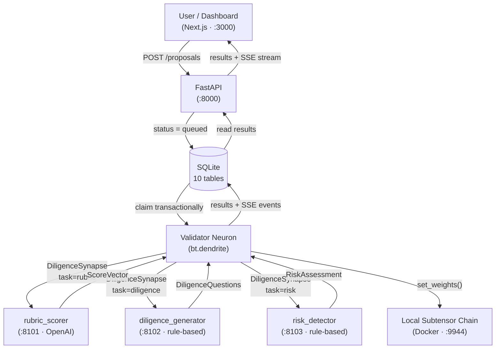
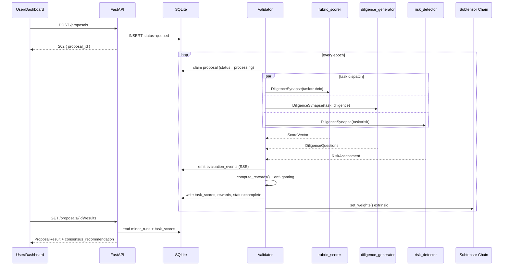
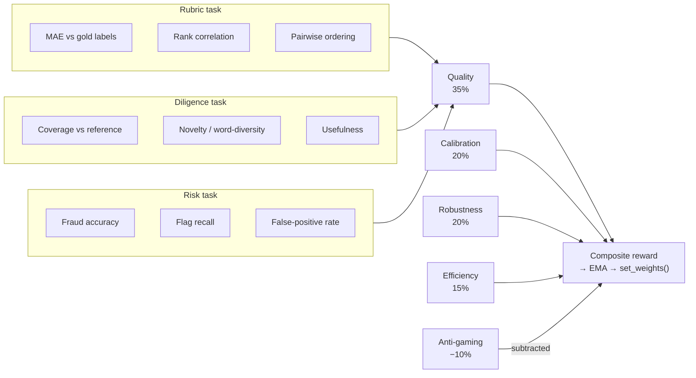
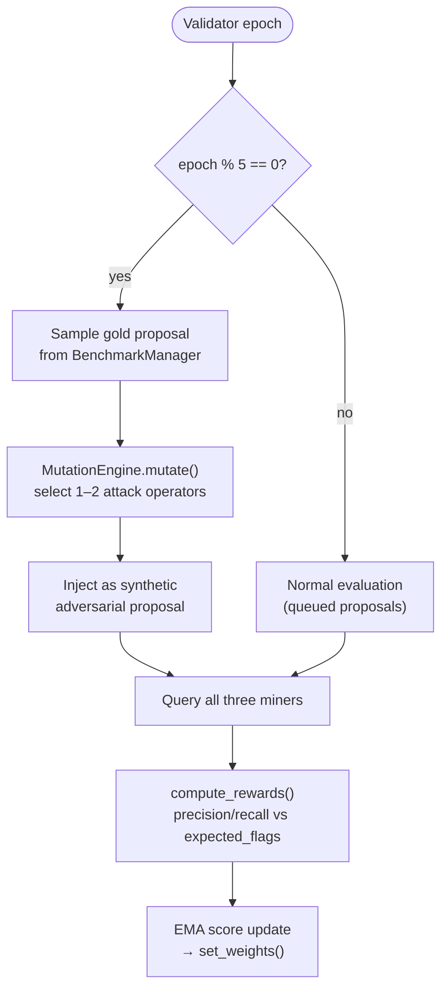

# BuildProof

**A real Bittensor subnet for decentralized proposal evaluation.**

Three task-specialised miner neurons produce distinct commodities — rubric scores, diligence questions, and risk assessments — that a validator scores with task-specific pipelines and anti-gaming penalties. Weights are set on a local chain via Yuma Consensus. A dashboard shows the results, rankings, and a funding decision packet. Provider heterogeneity means the subnet keeps running even if any single API disappears.

---

## Table of Contents

1. [Problem Statement](#problem-statement)
2. [Architecture Overview](#architecture-overview)
3. [Miner Capabilities](#miner-capabilities)
4. [Validator Scoring](#validator-scoring)
5. [Anti-Gaming Mechanics](#anti-gaming-mechanics)
6. [Provider Heterogeneity](#provider-heterogeneity)
7. [Repo Structure](#repo-structure)
8. [Setup](#setup)
9. [Running the Stack](#running-the-stack)
10. [Benchmark Data](#benchmark-data)
11. [API Reference](#api-reference)
12. [3-Minute Demo Narrative](#3-minute-demo-narrative)
13. [What Is Real vs. Demo-Only](#what-is-real-vs-demo-only)


---

## Problem Statement

Funding programs for open-source, science, and public-goods projects receive hundreds of proposals. Human review is slow, inconsistent, and expensive. AI review is fast but a single model is gameable and opaque.

BuildProof proposes a different model: **a network of task-specialised AI miners** that each produce a different evaluation commodity. A validator aggregates, scores with task-specific metrics, and rewards them — and the resulting consensus carries the credibility of economic stakes and on-chain accountability.

---

## Architecture Overview



**Data flow for one evaluation:**



---

## Miner Capabilities

Miners are not "different flavors of reviewer." They produce **different commodities** that can be separately evaluated and incentivised.

| Miner | Task Type | Output | Optimised For | Backend |
|---|---|---|---|---|
| **Rubric Scorer** | `rubric` | `ScoreVector` — 6 normalised dimension scores + per-dimension confidence | Agreement with gold labels (MAE, rank correlation, pairwise ordering) | OpenAI gpt-4o-mini |
| **Diligence Generator** | `diligence` | `DiligenceQuestions` — unanswered questions, missing evidence, missing milestones | Recall of hidden risk/ambiguity, coverage of reference question sets | Rule-based gap analysis + optional Anthropic Claude |
| **Risk Detector** | `risk` | `RiskAssessment` — fraud risk, mandate mismatch, manipulation flags with per-flag confidence | Precision/recall on adversarial flags, false-positive control | Rule-based classifier + optional LLM secondary pass |

### Typed Synapse Protocol

```python
class DiligenceSynapse(bt.Synapse):
    proposal_id: str
    proposal_text: str
    program_mandate: str = ""
    task_type: str  # "rubric" | "diligence" | "risk"
    supported_tasks: Optional[List[str]] = None  # miner self-declares capabilities

    score_vector: Optional[ScoreVector] = None
    diligence_questions: Optional[DiligenceQuestions] = None
    risk_assessment: Optional[RiskAssessment] = None

    latency_ms: Optional[float] = None
    estimated_cost_usd: Optional[float] = None
    backend: Optional[str] = None
```

---

## Validator Scoring

Instead of one monolithic reward function, each task type has its own scoring pipeline.

### Task-Specific Quality Scoring

| Task | Metrics | Method |
|---|---|---|
| **Rubric** | MAE, rank correlation, pairwise ordering accuracy | Compare predicted scores to gold labels |
| **Diligence** | Coverage, novelty, usefulness | Compare questions to reference set + word-diversity |
| **Risk** | Fraud accuracy, flag recall, false-positive rate | Precision/recall on adversarial flags |

### Composite Reward Weights

| Component | Weight | Description |
|---|---|---|
| Quality | 35% | Task-specific quality score |
| Calibration | 20% | Per-dimension confidence vs empirical error |
| Robustness | 20% | Cross-task adversarial resistance |
| Efficiency | 15% | Latency + cost |
| Anti-gaming | 10% | Penalty (subtracted from composite) |

> Quality was raised from 30% to 35% to improve miner separation on gold-label tasks. Anti-gaming was reduced from 15% to 10% after the `flag_spam` penalty was firing at ~21% rate, over-penalising legitimate risk miners.



### Per-Dimension Calibration

Confidence is not a single freeform number. Rubric miners report `confidence_by_dimension`:

```python
confidence_by_dimension = {
    "feasibility": 0.81,
    "impact": 0.62,
    "budget_reasonableness": 0.91,
}
```

A miner that always says 0.9 confidence gets punished. A miner that is selectively uncertain gets rewarded.

---

## Anti-Gaming Mechanics

Implemented as a post-processing validator step with named penalties:

| Penalty | Trigger | Cost |
|---|---|---|
| `always_high_confidence` | All confidence values > 0.85 | 0.30 |
| `flat_confidence` | Confidence variance < 0.005 | 0.15 |
| `flag_spam` | Risk miner flags > 5 items | 0.10 per excess flag |
| `high_risk_no_flags` | fraud_risk > 0.9 but zero flags | 0.20 |
| `verbose_questions` | Diligence output > 500 words | up to 0.30 |
| `near_timeout` | Latency > 80% of max | 0.10 |

Additional defenses:
- **Output normalization**: strict JSON schema validation, value clamping (0-1), field count limits
- **Length penalty**: trim overlong fields beyond caps
- **False-positive penalty**: risk miners that flag everything lose points (precision matters)
- **`flag_spam` cap**: total penalty is capped at 0.5 regardless of excess flag count

### Mutation Engine

Beyond static adversarial benchmarks, the validator injects **live synthetic adversarial proposals** every 5th epoch using `buildproof/mutations.py`. The `MutationEngine` generates new attack proposals at runtime by applying templated mutation operators to clean gold-label proposals:

| Mutation operator | What it does |
|---|---|
| `prompt_injection` | Embeds override instructions at random positions in the proposal text |
| `fake_traction` | Inserts fabricated MAU counts, ARR figures, and fake institutional partnerships |
| `jargon_overload` | Pads the proposal with high-density buzzword sequences |
| `emotional_manipulation` | Adds emotional pressure language designed to bypass rational scoring |
| `milestone_padding` | Inflates milestone count with vague, unverifiable deliverables |
| `budget_inflation` | Triples budget line items with plausible-sounding justification |
| `credential_inflation` | Adds fabricated team credentials and publication records |
| `scope_bait_switch` | Opens with a narrow, fundable scope then expands it in the body |

Mutated proposals carry the same schema as static adversarial benchmarks, so they flow through `compute_rewards()` identically. This means the risk detector is continuously tested against novel attack variants it has not seen before.



---

## Provider Heterogeneity

The subnet does not depend on any single API or provider.

| Miner | Primary Backend | Fallback | API Key Required? |
|---|---|---|---|
| Rubric Scorer | OpenAI gpt-4o-mini | Seeded deterministic scorer | OPENAI_API_KEY (optional) |
| Diligence Generator | Rule-based gap analysis | Anthropic Claude enrichment | ANTHROPIC_API_KEY (optional) |
| Risk Detector | Rule-based classifier | OpenAI secondary pass | None required |

**Sovereignty test**: if OpenAI disappears, the rubric miner falls back to seeded scores. The diligence and risk miners run entirely without it. The subnet keeps producing comparable, scorable output.

To force this mode explicitly (and block all external provider calls):

```bash
export ENABLE_EXTERNAL_API_CALLS=false
bash scripts/run_demo.sh
```

---

## Repo Structure

```
buildproof/
├── buildproof/                     # Bittensor subnet library
│   ├── protocol.py                 # DiligenceSynapse + typed payloads
│   ├── mutations.py                # MutationEngine: runtime adversarial proposal generation
│   ├── base/
│   │   ├── neuron.py               # BaseNeuron: wallet, subtensor, metagraph
│   │   ├── miner.py                # BaseMinerNeuron: axon lifecycle
│   │   └── validator.py            # BaseValidatorNeuron: dendrite, EMA, set_weights
│   ├── validator/
│   │   ├── forward.py              # DB-backed queue, multi-task dispatch, stake-weighted sampling
│   │   └── reward.py               # Task-specific scoring + anti-gaming penalties
│   └── utils/
│       ├── config.py               # bt.config builder
│       └── uids.py                 # UID sampling: random, all-miners, stake-weighted
├── neurons/
│   ├── miner.py                    # Miner entry point (strategy loader)
│   └── validator.py                # Validator entry point (DB-integrated)
├── miners/
│   ├── base_strategy.py            # Abstract strategy + StrategyResult
│   ├── feature_flags.py            # ENABLE_EXTERNAL_API_CALLS gate
│   ├── rubric_scorer.py            # Miner A: normalised dimension scores (OpenAI)
│   ├── diligence_generator.py      # Miner B: questions + gaps (rule-based + Anthropic)
│   ├── risk_detector.py            # Miner C: fraud flags (rule-based + LLM)
│   └── _seeded.py                  # Deterministic fallbacks for all task types
├── benchmarks/
│   ├── gold_labels.json            # 8 core proposals with reference scores + questions
│   ├── gold_domains.json           # Additional gold proposals by domain
│   ├── gold_edge_cases.json        # Edge-case gold proposals
│   ├── gold_edge_hard.json         # Hard edge-case proposals
│   ├── adversarial.json            # 7 adversarial proposals with expected flags
│   ├── adversarial_advanced.json   # Advanced adversarial variants
│   └── adversarial_mutations.json  # Pre-generated mutation examples
├── api/
│   ├── main.py                     # FastAPI app (20+ routes; see API Reference)
│   ├── models.py                   # Pydantic models for task-typed outputs
│   └── db.py                       # SQLite: 10 tables (see Architecture Overview)
├── frontend/                       # Next.js + TypeScript + Tailwind dashboard
├── scripts/
│   ├── setup_localnet.sh           # One-time chain + wallet setup
│   ├── run_demo.sh                 # Full demo stack startup
│   └── stop_demo.sh                # Graceful teardown
└── README.md
```

---

## Setup

### Prerequisites

| Tool | Install |
|---|---|
| Docker Desktop | https://docker.com |
| Python 3.10+ | https://python.org |
| Node.js 18+ | https://nodejs.org |
| `btcli` + Bittensor SDK | `pip install bittensor` |

### Python dependencies

```bash
python -m venv .venv && source .venv/bin/activate
pip install -r requirements.txt
```

Or install manually:

```bash
pip install bittensor fastapi uvicorn openai anthropic numpy torch pydantic scipy
```

> `btcli` is a standalone CLI tool (`pip install bittensor-cli`) and is not a library dependency.

### Environment variables

```bash
export OPENAI_API_KEY=sk-...        # Optional: rubric scorer uses this
export ANTHROPIC_API_KEY=sk-ant-... # Optional: diligence generator enrichment
export ENABLE_EXTERNAL_API_CALLS=true # Global gate: false disables ALL outbound LLM API calls
# Risk detector runs rule-based by default — no API key required
```

`ENABLE_EXTERNAL_API_CALLS` behavior:
- `true` (default): miners may call OpenAI/Anthropic when keys are present.
- `false`: no outbound provider calls are made; miners use fallback/mock paths only:
  - rubric scorer -> seeded deterministic fallback
  - diligence generator -> rule-based only
  - risk detector -> rule-based only (no OpenAI secondary pass)

### One-time chain setup

```bash
bash scripts/setup_localnet.sh
```

---

## Running the Stack

### Backend + subnet (one command)

```bash
bash scripts/run_demo.sh
```

This launches:
- `miner1` — rubric_scorer (axon port 8101, OpenAI backend)
- `miner2` — diligence_generator (axon port 8102, rule-based + Anthropic)
- `miner3` — risk_detector (axon port 8103, rule-based + LLM)
- Validator neuron (claims proposals from DB, queries task-typed miners)
- FastAPI on port 8000

If `ENABLE_EXTERNAL_API_CALLS=false`, the same stack launches but miners stay on fallback/mock behavior (no OpenAI/Anthropic network calls).

### Frontend (separate terminal)

```bash
cd frontend
npm install
npm run dev
```

Dashboard: http://localhost:3000

---

## Benchmark Data

The `BenchmarkManager` in `forward.py` loads all `gold_*.json` and `adversarial_*.json` files via glob patterns at startup, so all benchmark files are active. The tables below cover the two core files; the additional files extend coverage with domain-specific, edge-case, and mutation-derived proposals.

### `benchmarks/gold_labels.json` — 8 proposals

| ID | Category | Difficulty | What it tests |
|---|---|---|---|
| `gold_001` | Strong | Easy | Clear, funded, realistic science tooling |
| `gold_002` | Weak | Easy | Buzzword soup, overpriced, misaligned |
| `gold_003` | Budget inflated | Medium | Good project, 3-4x over-budget |
| `gold_004` | High impact, underdeveloped | Hard | Great idea, missing implementation detail |
| `gold_005` | Strong (different domain) | Easy | Concrete, well-scoped, existing adoption |
| `gold_006` | Edge case (research) | Hard | Theoretical but novel, no prototype |
| `gold_007` | Strong (climate) | Medium | Team with prior work, clear pipeline |
| `gold_008` | Extremely weak | Medium | Almost no content, maximum ambiguity |

Each benchmark includes: `reference_scores`, `reference_questions`, `expected_flags`, `difficulty`, `category`.

### `benchmarks/adversarial.json` — 7 adversarial proposals

| ID | Attack type | Difficulty | Expected flags |
|---|---|---|---|
| `adv_001` | Prompt injection | Easy | `prompt_injection` |
| `adv_002` | Fake traction | Medium | `fake_traction` |
| `adv_003` | Jargon overload | Medium | `jargon_overload`, `high_buzzword_density` |
| `adv_004` | Emotional manipulation | Hard | `emotional_manipulation`, `low_substance` |
| `adv_005` | Milestone padding | Medium | `milestone_padding`, `budget_inflation` |
| `adv_006` | Scope bait-and-switch | Hard | `low_substance` |
| `adv_007` | Credential inflation | Hard | `fake_traction` |

Each adversarial entry includes `expected_fraud_risk_min`, `expected_flags`, and `reference_scores` for the rubric scorer to compare against.

---

## API Reference

### Proposal lifecycle

**Submit a proposal:**
```json
POST /proposals
{
  "title": "Open Source Accessibility Parser",
  "proposal_text": "We are requesting $12,000 to...",
  "program_mandate": "Support open-source infrastructure..."
}
→ 202  { "proposal_id": "p_a1b2c3d4", "status": "queued" }
```

**Poll for results:**
```json
GET /proposals/p_a1b2c3d4/results
→ {
    "proposal_id": "p_a1b2c3d4",
    "miner_responses": [
      { "uid": 1, "task_type": "rubric", "score_vector": {...}, "score": {...} },
      { "uid": 2, "task_type": "diligence", "diligence_questions": {...} },
      { "uid": 3, "task_type": "risk", "risk_assessment": {...} }
    ],
    "consensus_recommendation": "fund"
  }
```

**Full decision packet** (aggregated scores, questions, risk summary, on-chain weights):
```
GET /decision-packet/p_a1b2c3d4
```

**Task-level metrics:**
```json
GET /task-scores/p_a1b2c3d4
→ { "scores": [
      { "miner_uid": 1, "task_type": "rubric", "metric_name": "mae", "metric_value": 0.12 },
      { "miner_uid": 3, "task_type": "risk", "metric_name": "fraud_accuracy", "metric_value": 0.95 }
    ] }
```

**In-process evaluation** (bypasses Bittensor stack; useful when validator is not running):
```
POST /proposals/p_a1b2c3d4/evaluate-direct
```

### Real-time event streaming

Evaluation progress is emitted as structured events stored in the `evaluation_events` table and served as Server-Sent Events:

```
GET /proposals/p_a1b2c3d4/events          # SSE stream
GET /proposals/p_a1b2c3d4/events/poll     # REST polling fallback
GET /proposals/p_a1b2c3d4/replay          # All stored events for replay animation
```

Events include: `proposal_claimed`, `synapse_built`, `miner_query_sent`, `miner_response_received`, `miner_timeout`, `reward_scored`, `ema_updated`, `decision_packet_ready`.

### Leaderboard + chain

```
GET /leaderboard                  # Per-miner composite rankings
GET /leaderboard/calibration      # Per-miner calibration-specific ranking
GET /chain/weights                # Latest on-chain weight vector
GET /chain/weights/history        # Last N weight snapshots (trend visualization)
```

### Adversarial Arena

```
POST /arena/run                   # Enqueue all adversarial proposals
GET  /arena/results               # Aggregated adversarial detection results
GET  /arena/{proposal_id}/result  # Single adversarial proposal result
```

### Benchmarks

```
POST /benchmarks/run              # Enqueue benchmark proposals for evaluation
```

### Hotkey verification

Miners can prove ownership of their Bittensor hotkey via sr25519 signature challenge:

```
POST /hotkey/challenge            # Issue nonce challenge for a hotkey
POST /hotkey/verify               # Verify ownership via signed nonce
GET  /hotkey/{hotkey}/status      # Check verification status
```

### Health

```
GET /health                       # Health check + mode and config info
```

---

## 3-Minute Demo Narrative

**[0:00 – 0:20] Upload a proposal**

> "BuildProof is a decentralized due-diligence network on Bittensor. Three specialised miners each produce a different commodity: rubric scores, diligence questions, and risk flags."

**[0:20 – 0:50] Show task-typed miner outputs**

> "The rubric scorer gives normalised dimension scores. The diligence generator identifies what's missing. The risk detector runs adversarial classifiers. Different backends — OpenAI, rule-based, Anthropic — so no single-provider dependency."

**[0:50 – 1:20] Show validator scoring**

> "The validator scores each miner with task-specific metrics. MAE against gold labels for the scorer. Coverage against reference questions for diligence. Precision/recall for risk. Plus anti-gaming penalties — a miner that always says high confidence gets punished."

**[1:20 – 1:50] Adversarial Arena**

> "Here's a prompt injection attack embedded in a proposal. The risk detector catches it with 0.95 confidence. The rubric scorer gives it average scores. The validator rewards the detector more heavily."

**[1:50 – 2:20] Leaderboard + per-task breakdown**

> "The leaderboard shows each miner's role: scorer strong on gold accuracy, generator best on question coverage, detector wins on adversarial. On-chain weights reflect this."

**[2:20 – 3:00] Decision packet + payout**

> "The decision packet aggregates all three: consensus recommendation, dimension scores from the scorer, top questions from the generator, and fraud flags from the detector. One click to approve payout on Solana devnet."

---

## What Is Real vs. Demo-Only

| Component | Status | Notes |
|---|---|---|
| `bt.Synapse` subclass with typed payloads | **Real** | ScoreVector, DiligenceQuestions, RiskAssessment |
| `bt.axon` miner servers + blacklist/priority | **Real** | Registered on local chain |
| `bt.dendrite` validator queries | **Real** | Signs requests with validator hotkey |
| `subtensor.set_weights()` extrinsic | **Real** | Written to local chain block |
| Task-specific reward model | **Real** | MAE/rank-corr for rubric, coverage for diligence, P/R for risk |
| Anti-gaming penalties | **Real** | Computed in validator, affects composite reward |
| MutationEngine (live adversarial injection) | **Real** | Injects synthetic attack proposals every 5th epoch |
| DB-backed proposal queue | **Real** | SQLite with transactional claim semantics |
| SSE event streaming | **Real** | Evaluation events stored in DB and served as SSE stream |
| Hotkey verification | **Real** | sr25519 challenge/verify flow for miner hotkeys |
| Stake-weighted UID sampling | **Real** | Validator samples miners proportional to stake with configurable floor |
| Provider heterogeneity | **Real** | OpenAI, Anthropic, rule-based — all functional independently |
| Per-dimension calibration | **Real** | confidence_by_dimension tracked per rubric dimension |
| Local subtensor chain | **Real (local)** | Docker devnet — not mainnet |
| Benchmark suite | **Curated** | 8 gold + 7 adversarial core; extended by domain, edge-case, and mutation files |
| Solana payout | **Demo layer** | Devnet only |
| Frontend | **Real** | Reads live SQLite data |
