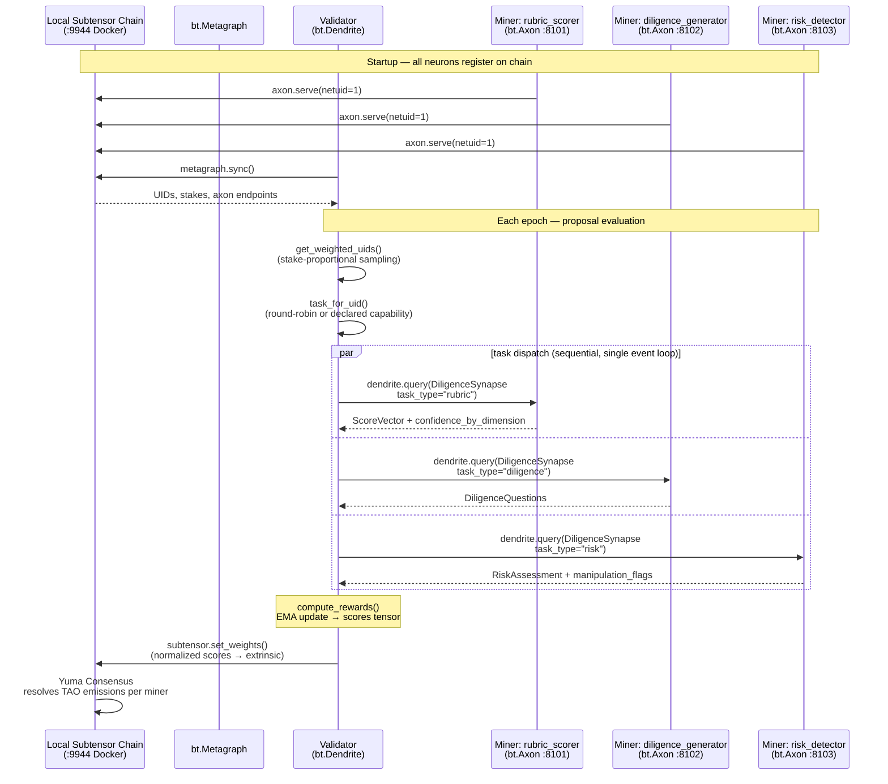
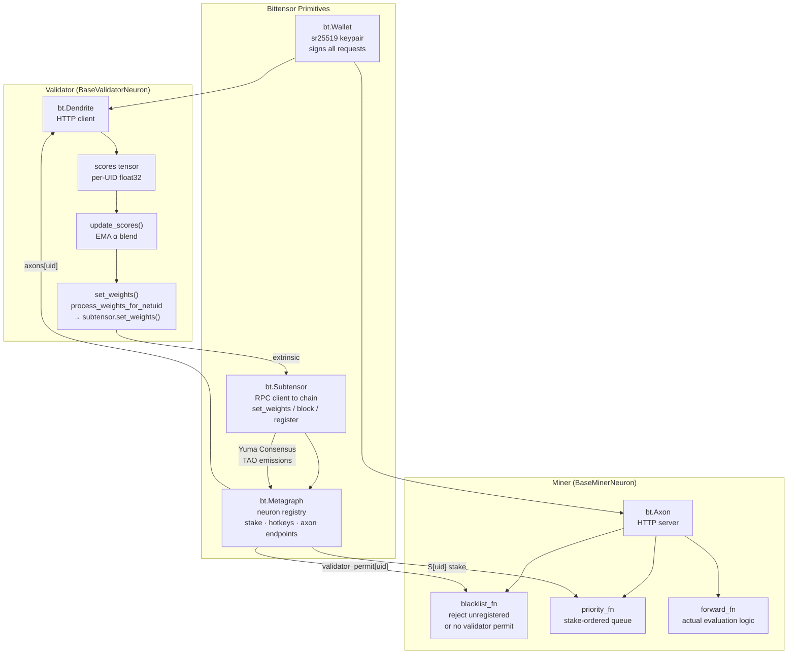

# Bittensor Integration

## Epoch sequence

```mermaid
sequenceDiagram
    participant Chain as Local Subtensor Chain<br/>(:9944 Docker)
    participant Meta as bt.Metagraph
    participant Val as Validator<br/>(bt.Dendrite)
    participant M1 as Miner: rubric_scorer<br/>(bt.Axon :8101)
    participant M2 as Miner: diligence_generator<br/>(bt.Axon :8102)
    participant M3 as Miner: risk_detector<br/>(bt.Axon :8103)

    Note over Chain,M3: Startup — all neurons register on chain
    M1->>Chain: axon.serve(netuid=1)
    M2->>Chain: axon.serve(netuid=1)
    M3->>Chain: axon.serve(netuid=1)
    Val->>Chain: metagraph.sync()
    Chain-->>Val: UIDs, stakes, axon endpoints

    Note over Val,M3: Each epoch — proposal evaluation
    Val->>Val: get_weighted_uids()<br/>(stake-proportional sampling)
    Val->>Val: task_for_uid()<br/>(round-robin or declared capability)

    par task dispatch (sequential, single event loop)
        Val->>M1: dendrite.query(DiligenceSynapse<br/>task_type="rubric")
        M1-->>Val: ScoreVector + confidence_by_dimension
    and
        Val->>M2: dendrite.query(DiligenceSynapse<br/>task_type="diligence")
        M2-->>Val: DiligenceQuestions
    and
        Val->>M3: dendrite.query(DiligenceSynapse<br/>task_type="risk")
        M3-->>Val: RiskAssessment + manipulation_flags
    end

    Note over Val: compute_rewards()<br/>EMA update → scores tensor

    Val->>Chain: subtensor.set_weights()<br/>(normalized scores → extrinsic)
    Chain->>Chain: Yuma Consensus<br/>resolves TAO emissions per miner
```

## Primitive relationships

```mermaid
flowchart TD
    subgraph bt_primitives["Bittensor Primitives"]
        W["bt.Wallet\nsr25519 keypair\nsigns all requests"]
        S["bt.Subtensor\nRPC client to chain\nset_weights / block / register"]
        MG["bt.Metagraph\nneuron registry\nstake · hotkeys · axon endpoints"]
    end

    subgraph miner_side["Miner (BaseMinerNeuron)"]
        AX["bt.Axon\nHTTP server"]
        BL["blacklist_fn\nreject unregistered\nor no validator permit"]
        PR["priority_fn\nstake-ordered queue"]
        FW["forward_fn\nactual evaluation logic"]
        AX --> BL & PR & FW
    end

    subgraph validator_side["Validator (BaseValidatorNeuron)"]
        DN["bt.Dendrite\nHTTP client"]
        SC["scores tensor\nper-UID float32"]
        EMA["update_scores()\nEMA α blend"]
        SW["set_weights()\nprocess_weights_for_netuid\n→ subtensor.set_weights()"]
        DN --> SC --> EMA --> SW
    end

    W --> AX
    W --> DN
    S --> MG
    MG -->|"axons[uid]"| DN
    MG -->|"validator_permit[uid]"| BL
    MG -->|"S[uid] stake"| PR
    SW -->|"extrinsic"| S
    S -->|"Yuma Consensus\nTAO emissions"| MG
```
